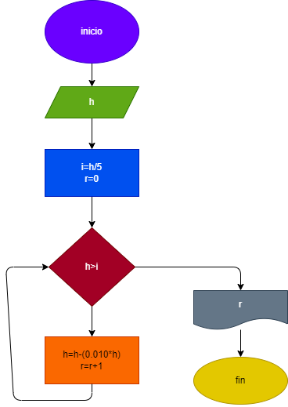

# Una pelota se deja caer desde una altura h, y en cada rebote sube el 10 %menos del anterior. Hacer el diagrama de flujo y el programa en payton, que lea h y qué calculé en cual rebote la pelota no alcanza a a subir la quinta parte de la altura inicial

wn 1980 la cuidada a tenia 3.5 millones de habitantes y una taza de crecimiento del 7% anual;si la ciudad b tenia 5 millones y una taza de crecimiento del 5 % anual. si el crecimiento poblacional se mantiene constante en las dps ciudades, hacer el diagrama de flujo y el programa en paython que calcule e imprima en que año la poblacion de la ciudad a es mayor que la de la cuidad b